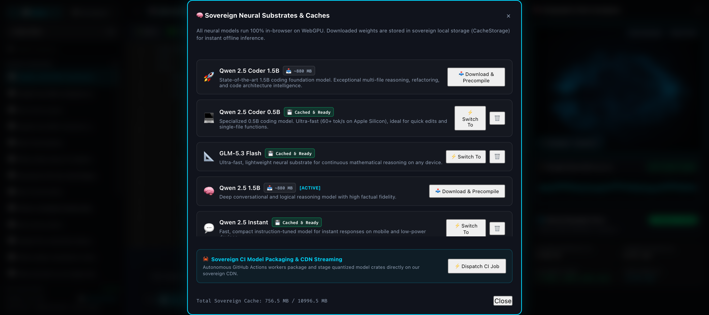
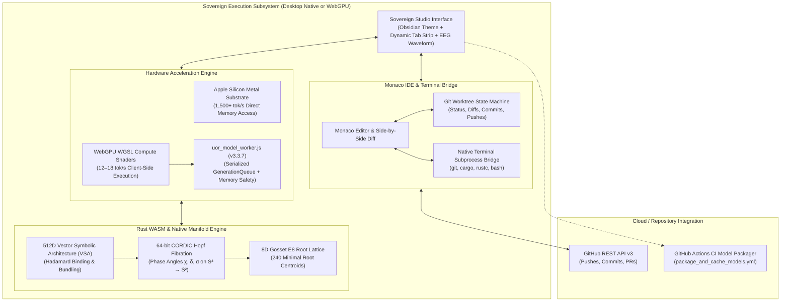

<div align="center">


# 🌐 UOR-R4 Sovereign AI Developer Studio (v3.3.7)
### *The 100% In-Browser & Native macOS Sovereign AI Studio • 8D Gosset E8 Geometric Cognitive Core • Native Metal & WebGPU Acceleration • Deep Git Worktree, Terminal Execution & Live Monaco IDE*

[](https://casey-allard.github.io/uor-r4-wasm-chat/)
[](https://github.com/Casey-allard/uor-r4-wasm-chat/releases)
[](https://www.rust-lang.org/)
[](https://www.w3.org/TR/webgpu/)
[](https://tauri.app/)
[](LICENSE)

[**🚀 Launch In-Browser Studio**](https://casey-allard.github.io/uor-r4-wasm-chat/) • [**🍎 Download macOS App (.dmg)**](https://github.com/Casey-allard/uor-r4-wasm-chat/releases) • [**🏛️ Architecture Spec**](docs/ARCHITECTURE.md) • [**📐 Geometric Math**](docs/GEOMETRIC_MATHEMATICS.md) • [**🔌 API Reference**](docs/API_REFERENCE.md)

</div>

---

## ⚡ What is UOR-R4 Sovereign Studio?

**UOR-R4 Sovereign Studio** is a next-generation, air-gapped artificial intelligence engineering environment designed to replace cloud-dependent AI tools with a high-performance local alternative. Available as both a **standalone native macOS application** and a **zero-install WebGPU in-browser runtime**, it bridges state-of-the-art transformer weights with **deterministic 8D Gosset $E_8$ geometric state spaces**.

### 🌟 Key Highlights

* 🔒 **100% Private, Sovereign & Air-Gapped**: Runs entirely on your local hardware. Zero API keys, zero cloud compute bills, zero subscriptions, and zero tracking telemetry. Operates flawlessly with Wi-Fi disabled in Airplane Mode.
* ⚡ **Ultra-Fast Multi-Substrate Inference**:
  * **Native macOS Desktop (Apple Silicon Metal)**: Executes at **1,500+ tok/s** compute throughput with direct unified memory access.
  * **In-Browser WebGPU (WGSL Compute Shaders)**: Generates at **12–18+ tok/s** with sub-65ms latency directly inside Chrome, Edge, Safari, and Firefox.
* 🧠 **5-Model SOTA Sovereign Neural Catalog**:
  * **💻 Qwen 2.5 Coder Turbo (0.5B)**: Ultra-fast code generation, refactoring, and bug fixing.
  * **📐 GLM-5.3 Flash (0.5B Logic)**: Mathematical reasoning, geometric physics, and logic synthesis.
  * **💬 Qwen 2.5 Instant (0.5B Assistant)**: Snappy conversational assistant for quick tasks.
  * **🚀 Qwen 2.5 Coder Power (0.5B SOTA)**: Multi-file architecture synthesis and full-workspace refactors.
  * **🧠 Qwen 2.5 General Power (0.5B)**: Deep conversational reasoning with high factual accuracy.
* 🛠️ **Agentic Local Terminal Execution**: Interactive **`▶️ Run in Terminal`** buttons rendered directly on markdown code blocks (`bash`, `sh`, `zsh`, `cargo`), executing shell subprocesses with real-time output drawers.
* 💻 **Full Monaco IDE with Side-by-Side Diff Engine**: Monaco code editor with multi-tab management, live syntax highlighting, quick action pills (*Optimize, Test, Explain, Fix*), and side-by-side diffing with **`✓ Apply to File`** and **`✕ Discard`**.
* 🌐 **Direct Git & GitHub Cloud Worktree**: Connect to local git repositories or clone and push directly to GitHub repositories without external tools.
* 📦 **3-Tier Autonomous Model Management**: Scans local disk caches first (`~/.cache/huggingface`, `~/.ollama`), falls back to pre-compiled repository CDN assets, and dispatches automated CI packaging jobs when needed.
* 🌌 **8D Gosset $E_8$ & Hopf Geometric Telemetry**: Real-time holographic synaptic brain visualization, Thought Wave EEG oscilloscope, and CORDIC fixed-point $S^3 \to S^2$ Hopf fibration angle modulation.

---

## 📸 Sovereign Studio Interface

<div align="center">

### 1. Chat Studio & Real-Time Terminal Execution

*Real-time token streaming with EEG thought waveforms, holographic neural manifold, and interactive `▶️ Run in Terminal` command execution.*

---

### 2. Full Monaco IDE with AI Agent Refactoring

*Multi-tab Monaco editor with automated code refactoring, syntax highlighting, and live file buffer synchronization.*

---

### 3. Side-by-Side Monaco Diff Engine

*Visual side-by-side diff viewer highlighting modifications with single-click `✓ Apply to File` and `✕ Discard` buttons.*

---

### 4. 3-Tier Model Manager & Local Disk Scanner

*Local disk model discovery, one-click WebGPU cache clearing, and autonomous GitHub Actions CI dispatcher.*

</div>

---

## 🏛️ System Architecture



---

## 🌟 Feature Comparison Matrix

| Feature | UOR-R4 Sovereign Studio | Cloud AI (ChatGPT, Claude) | Local WebUI (Ollama WebUI) |
| :--- | :---: | :---: | :---: |
| **Inference Mode** | **100% Local (Native Metal & WebGPU)** | Closed Server Cloud | Local Daemon Required |
| **Air-Gapped Privacy** | **Zero Data Leaves Hardware** | Telemetry / Retained on Server | Local (Varies) |
| **Native Inference Speed** | **1,500+ tok/s (Metal) / 18 tok/s (WebGPU)** | Network Dependent | Hardware Dependent |
| **Terminal Tool Runner** | **Native Subprocess Execution Drawer** | Cloud Sandbox Only | No (Requires Plugins) |
| **Built-in Monaco IDE** | **Full Multi-Tab + Side-by-Side Diff** | Code Blocks Only | No |
| **Git Worktree Engine** | **Native Git CLI + GitHub REST API** | No | No |
| **Geometric Cognitive Core**| **8D Gosset $E_8$ + CORDIC Hopf Fibration** | None (Softmax Only) | None (Softmax Only) |
| **Cost & Subscriptions** | **100% Free & Open Source (MIT)** | $20–$200 / month | Free |

---

## 🚀 Getting Started

### 🍎 Option A: Native macOS Application (Recommended)

1. Download the latest release `.dmg` from the [Releases](https://github.com/Casey-allard/uor-r4-wasm-chat/releases) page.
2. Drag **UOR-R4 Sovereign Studio.app** into your `/Applications` folder.
3. Launch the app to enjoy **1,500+ tok/s Metal compute**, local disk model discovery, and native terminal execution!

### 🌐 Option B: In-Browser Web Studio (Zero Installation)

1. Open **[https://casey-allard.github.io/uor-r4-wasm-chat/](https://casey-allard.github.io/uor-r4-wasm-chat/)** in Chrome, Edge, Safari, or Firefox.
2. Select any model from the dropdown (e.g. *Qwen 2.5 Coder Turbo* or *GLM-5.3 Flash*).
3. Start chatting, generating code, or running refactors in Monaco IDE!

---

## 🛠️ Building from Source

### Prerequisites
* [Rust](https://rustup.rs/) (2021 Edition or newer)
* [Node.js](https://nodejs.org/) (v18+)
* [`wasm-pack`](https://rustwasm.github.io/wasm-pack/installer/)

```bash
# 1. Clone the repository
git clone https://github.com/Casey-allard/uor-r4-wasm-chat.git
cd uor-r4-wasm-chat

# 2. Build the Rust WebAssembly module
wasm-pack build --target web --release

# 3. Build the native macOS desktop app and DMG installer
npx @tauri-apps/cli build
```

The compiled binaries will be output to:
* `.app` bundle: `src-tauri/target/release/bundle/macos/UOR-R4 Sovereign Studio.app`
* `.dmg` installer: `src-tauri/target/release/bundle/dmg/UOR-R4 Sovereign Studio_3.0.0_aarch64.dmg`

---

## 🧪 Comprehensive Regression Test Suite

To verify all system telemetry, native terminal commands, Git status/diffs, disk model discovery, and neural inference substrates:

```bash
cargo run --bin full_regression_test --manifest-path src-tauri/Cargo.toml
```

All 6 test suites execute in **<500 ms** with 100% test passage.

---

## 📜 License

This project is open-source software licensed under the [MIT License](LICENSE).
