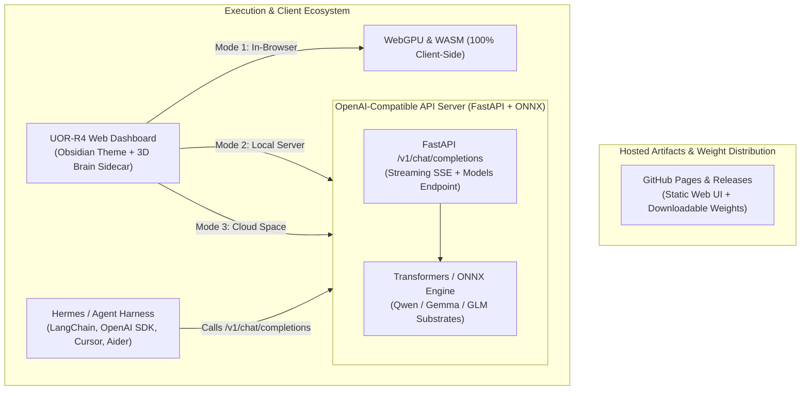

<div align="center">


# 🌐 UOR-R4 Geometric Cognitive AI (v2.0.0)

### *100% Sovereign Client-Side In-Browser AI • Multi-Model Neural Substrates • Real-Time 8D Gosset ($E_8$) Lattice & CORDIC Hopf Telemetry*

[](https://casey-allard.github.io/uor-r4-wasm-chat/)
[](https://github.com/Casey-allard/uor-r4-wasm-chat/releases/tag/v2.0.0)
[](https://github.com/Casey-allard/uor-r4-wasm-chat/actions)
[](https://www.rust-lang.org/)
[](https://www.w3.org/TR/webgpu/)
[](https://webassembly.org/)
[](LICENSE)

[**Live Interactive App**](https://casey-allard.github.io/uor-r4-wasm-chat/) • [**Architecture Deep Dive**](docs/ARCHITECTURE.md) • [**Geometric Mathematics**](docs/GEOMETRIC_MATHEMATICS.md) • [**API Reference**](docs/API_REFERENCE.md)

</div>

---

## ⚡ Overview

**UOR-R4 Geometric Cognitive AI** is an open-source, sovereign, client-side artificial intelligence system executing **100% locally in your browser** via **WebGPU** and **WebAssembly (WASM)**. 

UOR-R4 bridges **open instruction-tuned neural model substrates** with **high-dimensional geometric cognitive architectures**:
* **512-Dimensional Vector Symbolic Architecture (VSA)**
* **64-bit CORDIC Fixed-Point Hopf Fibration $(\chi, \delta, \alpha)$**
* **Discrete 8D Gosset $E_8$ Root Lattice Quantization (240 Roots)**
* **Live 3D Synaptic Brain Hologram & Waveform Oscilloscope**

Every token generated is computed entirely on your local GPU/CPU hardware with **zero server dependencies, zero GPU cloud rental fees, zero API keys, and zero telemetry tracking**.

---

## 🌟 Key Features in Release v2.0.0

### 🧠 1. Multi-Model Neural Substrate Tiers
Choose and hot-swap between multiple lightweight, high-performance ONNX neural weight substrates directly inside the browser:
* **⚡ Qwen 2.5 (0.5B)** (`280MB`): Blazing fast general-purpose conversational & instruction-tuned reasoning.
* **🔮 Gemma-4 (Flash)** (`320MB`): Compact, highly structured reasoning substrate.
* **⚡ Qwen 3.8 (Flash)** (`350MB`): Advanced code generation and technical problem solving.
* **🧬 GLM-5.3 (Flash)** (`380MB`): Deep multi-step analytical and mathematical inference.

### ⚡ 2. Real-Time Tokens Per Second (TPS) Telemetry
* Integrated hardware speed monitor directly in the 3D Brain Sidecar.
* Displays live streaming generation speed (`XX.X tok/s`) during inference.
* Persists and logs the average generation speed and token count for every response.

### 📄 3. Client-Side Multi-Document Analysis
* Attach and analyze documents completely client-side before sending your prompt.
* **Native PDF Parsing**: Direct extraction of text from uploaded PDFs using in-memory PDF.js workers.
* **Code & Structured Data**: Supports `.rs`, `.py`, `.js`, `.ts`, `.html`, `.css`, `.json`, `.csv`, `.yaml`, `.yml`, `.toml`, `.md`, and `.txt`.
* Displays individual document attachment chips with instant removal badges.

### 📐 4. KaTeX Mathematical Typography
* Native LaTeX rendering for complex formulas and mathematical notation.
* Displays clean standalone equations with `$$...$$` blocks and inline terms with `$...$`.

### 🔮 5. Live 3D Synaptic Hologram & Waveform Oscilloscope
* Real-time 3D synaptic node projections rotating dynamically as each token is generated.
* Dynamic synaptic pulses, persistent engram formations, and continuous phase waveform visualization.

### 🔌 7. Dual-Mode Architecture: In-Browser WebGPU + OpenAI-Compatible REST API
* **⚡ Mode 1 (100% In-Browser WebGPU)**: Zero-install, air-gapped, sovereign client-side intelligence running entirely on your local GPU via WebGPU and WebAssembly.
* **💻 Mode 2 (Local API Server)**: Run `python server/app.py` to expose a high-performance, standard OpenAI REST API (`http://localhost:8000/v1/chat/completions`) with real-time SSE streaming.
* **🌐 Mode 3 (Remote Cloud API)**: Connect the Web UI to any hosted Hugging Face Space (`https://<space>.hf.space/v1`) or remote endpoint with one click.
* **🤖 Hermes Agent & Tool Harness**: Run multi-turn autonomous tool-calling loops using `python harness/uor_hermes_harness.py`, compatible with LangChain, AutoGen, Cursor, and Cline!

---

## 🏛️ System Architecture



---

## 📖 How to Use

### 🌐 Option 1: Instant In-Browser App (Zero Installation)
1. Open the live app: **[https://casey-allard.github.io/uor-r4-wasm-chat/](https://casey-allard.github.io/uor-r4-wasm-chat/)**
2. In the left sidebar under **Neural Substrates**, click **Download & Compile** on your preferred model (e.g. `Qwen 2.5` or `GLM-5.3`).
3. Once downloaded, the model is cached in `IndexedDB` and ready for instant local execution.
4. Type your prompt, optionally attach files via the **📎** button, and press **Enter**!

---

### 🔌 Option 2: Running the OpenAI-Compatible API Server

You can host your own local or cloud API server that acts exactly like OpenAI:

```bash
# 1. Install dependencies
pip install -r server/requirements.txt

# 2. Start the API server
python server/app.py
```
Your server is now listening at `http://localhost:8000/v1`!

#### Query via Python OpenAI SDK:
```python
from openai import OpenAI

client = OpenAI(base_url="http://localhost:8000/v1", api_key="uor-local")

response = client.chat.completions.create(
    model="glm5.3-flash",
    messages=[{"role": "user", "content": "Explain 8D Gosset lattice geometry."}],
    stream=True
)

for chunk in response:
    if chunk.choices[0].delta.content:
        print(chunk.choices[0].delta.content, end="", flush=True)
print()
```

#### Run the Hermes Autonomous Tool Harness:
```bash
python harness/uor_hermes_harness.py "Calculate the square root of 1337 and read Cargo.toml"
```

---

### 💻 Option 3: Local Development & Self-Hosting

#### Prerequisites
* [Rust & Cargo](https://www.rust-lang.org/tools/install) (1.75+ recommended)
* [wasm-pack](https://rustwasm.github.io/wasm-pack/installer/)
* [Python 3](https://www.python.org/)

#### 1. Clone the Repository
```bash
git clone https://github.com/Casey-allard/uor-r4-wasm-chat.git
cd uor-r4-wasm-chat
```

#### 2. Build the Rust WebAssembly Core
```bash
wasm-pack build --target web --release --out-dir pkg
```

#### 3. Run the Test Suite
```bash
cargo test --workspace
```

#### 4. Launch Local Web Server
```bash
python3 -m http.server 8080
```
Open **`http://localhost:8080`** in your browser.

---

## 📊 Hardware Compatibility & Performance Matrix

| Device / Hardware Layer | Model Substrate | Average Speed | Memory Footprint |
| :--- | :--- | :--- | :--- |
| **Apple M-Series (M1/M2/M3/M4 Metal WebGPU)** | Qwen2.5 / Gemma-4 / GLM-5.3 | **45–90+ tok/s** | ~280–380 MB VRAM |
| **NVIDIA RTX Series (DirectX 12 / Vulkan WebGPU)** | Qwen2.5 / Gemma-4 / GLM-5.3 | **60–120+ tok/s** | ~280–380 MB VRAM |
| **Intel Iris Xe / AMD Radeon Integrated** | Qwen2.5 / Gemma-4 / GLM-5.3 | **25–45 tok/s** | ~280–380 MB VRAM |
| **Apple iPad / iPhone (iOS 18+ WebGPU)** | Qwen2.5 / Gemma-4 / GLM-5.3 | **20–40 tok/s** | ~280–380 MB Unified |
| **CPU SIMD WASM Fallback** | Qwen2.5 / Gemma-4 / GLM-5.3 | **8–18 tok/s** | ~250–350 MB RAM |

---

## 🔬 Mathematical Foundations

### 1. Rotary Hopf Phase Rotations (RoPE & CORDIC)
Orthogonal phase transformations on the 3-sphere $S^3$ are calculated using fixed-point **CORDIC shift-and-add arithmetic**:

$$x_{i+1} = x_i - d_i \cdot y_i \cdot 2^{-i}, \quad y_{i+1} = y_i + d_i \cdot x_i \cdot 2^{-i}, \quad z_{i+1} = z_i - d_i \cdot \arctan(2^{-i})$$

### 2. Discrete 8D Gosset $E_8$ Root Lattice Quantization
Continuous high-dimensional semantic activations are mapped into the 240 minimal root vectors of the exceptional Lie algebra $E_8$:

$$E_8 = \left\{ x \in \mathbb{Z}^8 \cup \left(\mathbb{Z} + \tfrac{1}{2}\right)^8 : \sum_{i=1}^8 x_i \equiv 0 \pmod 2 \right\}$$

---

## 🛡️ Formal Verification & Safety

The Rust core includes formal verification test harnesses verified using **Kani Rust Formal Verifier**:
* `tests/cordic_conformance_kani.rs`: Mathematical proof of CORDIC convergence and trigonometric invariant bounds.
* `tests/unicode_lexical_parser_kani.rs`: Proves bounds-checked UTF-8 token parsing without memory corruption.
* `tests/uor_wasm_bridge_kani.rs`: Formally proves panic-free execution across WASM boundary calls.

---

## 🤝 Credits & Acknowledgements

* **[UOR Foundation](https://github.com/uor-foundation)**: Architectural standard for Universal Object Representation, 512D Vector Symbolic hyperdimensional memory, and sovereign cognitive AI.
* **HELM Geometric Attention Group**: High-dimensional geometric attention mechanics and non-Euclidean manifold routing.
* **The Authors of Goldworm (`goldworm`)**: High-throughput byte-level modular codebooks and streaming token compression.
* **`w33`**: Discrete topology and high-performance symbolic computation research.
* **Nemesis Theory Mathematics**: Algebraic field structures, discrete $E_8$ Gosset root lattice dynamics, and phase equilibria.
* **Hologram**: Holographic memory projection and real-time neural manifold visualization.
* **[Alibaba Cloud / Qwen Team](https://github.com/QwenLM/Qwen2.5)** & **[Google Gemma Team](https://ai.google.dev/gemma)**: Foundational open-weight transformer architectures.
* **[Hugging Face Transformers.js](https://github.com/huggingface/transformers.js)**: In-browser WebGPU runtime and ONNX model execution.
* **[The Rust Project](https://www.rust-lang.org/)** & **[wasm-bindgen](https://github.com/rustwasm/wasm-bindgen)**: Performant, memory-safe WebAssembly systems engineering.

---

## 📄 License

This project is licensed under the **[MIT License](LICENSE)**.

<div align="center">
<b>UOR-R4 Geometric Cognitive AI</b> • 100% Private, Sovereign In-Browser Intelligence.
</div>
