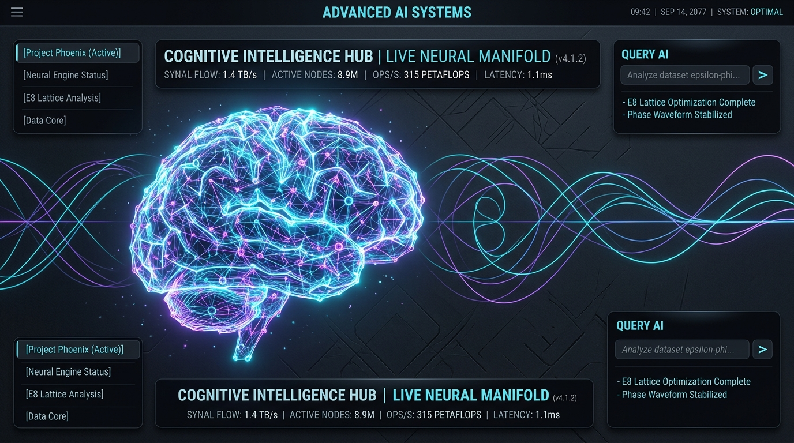
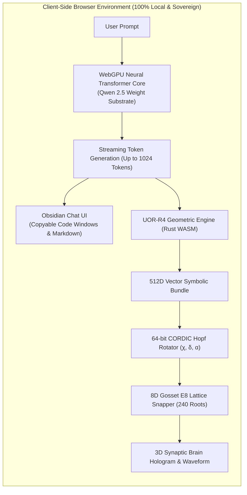
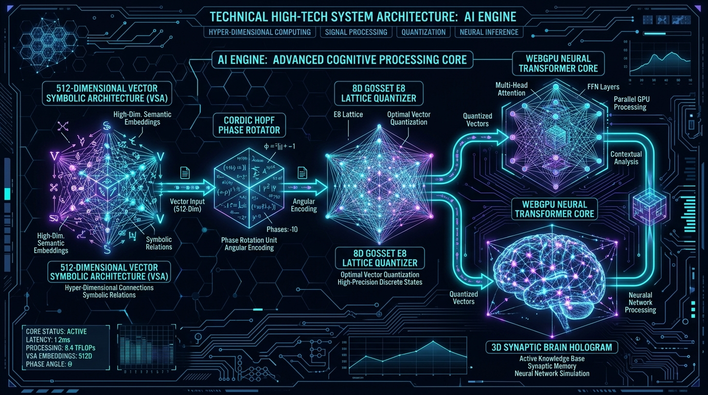

<div align="center">



# 🌐 UOR-R4 Geometric Cognitive AI

### *100% Client-Side In-Browser Neural AI with Real-Time 8D Gosset ($E_8$) Lattice & CORDIC Hopf Phase Dynamics*

[](https://casey-allard.github.io/uor-r4-wasm-chat/)
[](https://github.com/Casey-allard/uor-r4-wasm-chat/releases/tag/v1.0.0)
[](https://github.com/Casey-allard/uor-r4-wasm-chat/actions)
[](https://www.rust-lang.org/)
[](https://www.w3.org/TR/webgpu/)
[](https://webassembly.org/)
[](LICENSE)

[**Live Interactive App**](https://casey-allard.github.io/uor-r4-wasm-chat/) • [**Architecture Deep Dive**](docs/ARCHITECTURE.md) • [**Geometric Mathematics**](docs/GEOMETRIC_MATHEMATICS.md) • [**API Reference**](docs/API_REFERENCE.md)

</div>

---

## ⚡ Overview

**UOR-R4 Geometric Cognitive AI** is an open-source, client-side artificial intelligence architecture that combines **open pretrained neural weight substrates (Qwen 2.5)** with **high-dimensional geometric telemetry (512D Vector Symbolic Architecture, discrete 8D Gosset $E_8$ root lattice quantization, and 64-bit CORDIC Hopf phase rotations)**.

Executing **100% locally in the browser** via **WebGPU** and **WebAssembly (WASM)**, UOR-R4 delivers private, zero-latency inference with **zero server dependencies, zero GPU cloud costs, zero API keys, and zero telemetry tracking**.

> [!IMPORTANT]
> ### 🧬 Architectural Distinction: UOR-R4 vs. Pretrained Weight Substrates
> **UOR-R4 is a Geometric Cognitive Engine, not merely an LLM wrapper.**
> 
> * **The Lexical Substrate**: Open transformer weight tensors (such as `Qwen2.5-0.5B-Instruct` or `Qwen2.5-1.5B-Instruct`) provide the foundational vocabulary embeddings, multi-head attention weights, and broad linguistic representations.
> * **The Geometric Engine**: As token sequences stream from the model, their high-dimensional hidden states are continuously projected into **UOR-R4's 512D Vector Symbolic Architecture (VSA)**, rotated via **CORDIC Hopf Euler angles $(\chi, \delta, \alpha)$**, and snapped into **discrete 8D Gosset $E_8$ root lattice coordinates**.
> * **The Result**: A deterministic, explainable geometric state representation visualized in real time on an interactive 3D Synaptic Hologram while operating completely air-gapped on consumer hardware.



---

## 📸 Technical System Architecture



---

## 📖 How to Use

### 🌐 Option 1: Instant Browser Demo (No Installation Required)
1. **Open the Live Web App**: Visit [https://casey-allard.github.io/uor-r4-wasm-chat/](https://casey-allard.github.io/uor-r4-wasm-chat/) in any modern browser with WebGPU enabled (Chrome 113+, Microsoft Edge 113+, Safari 18+, or Firefox Nightly).
2. **First-Time Model Loading**:
   * On your first visit, the browser will download the quantized neural weights (~280 MB).
   * WebGPU shaders will automatically compile on your local graphics card.
   * Model weights are permanently cached in your browser's local **IndexedDB**, meaning subsequent visits start up instantly in under a second with zero redownloading.
3. **Chat & Prompting**:
   * Type any question into the bottom input capsule (e.g. coding problems, mathematical questions, philosophical inquiries, riddles, history, or science).
   * Press **Enter** or click the **Send** button.
4. **Observe Real-Time Geometric Telemetry**:
   * Watch the **3D Synaptic Brain Manifold** in the right drawer rotate dynamically as each token is generated.
   * Inspect the live **8D Gosset Lattice Coordinates**, **Hopf Phase Angles $(\chi, \alpha)$**, and continuous **Synaptic Waveforms**.
   * Copy generated programming code blocks with a single click using the **Copy code** button.

---

### 💻 Option 2: Local Development & Self-Hosting

#### Prerequisites
* [Rust & Cargo](https://www.rust-lang.org/tools/install) (1.75+ recommended)
* [wasm-pack](https://rustwasm.github.io/wasm-pack/installer/)
* [Python 3](https://www.python.org/) (for local static server)
* WebGPU-compatible browser

#### 1. Clone the Repository
```bash
git clone https://github.com/Casey-allard/uor-r4-wasm-chat.git
cd uor-r4-wasm-chat
```

#### 2. Build the Rust WebAssembly Core
```bash
wasm-pack build --target web --release --out-dir pkg
```

#### 3. Run the Unit & Formal Verification Tests
```bash
cargo test --workspace
```

#### 4. Launch the Local Web Server
```bash
python3 -m http.server 8080
```
Open **`http://localhost:8080`** in your browser.

---

## 🌟 Key Features in Release v1.0.0

### 🧠 1. Deep In-Browser Neural Intelligence
* **Qwen 2.5 Neural Substrate**: High-precision instruction-tuned reasoning model executing locally on client GPU hardware at 30–80+ tokens/second.
* **1024 Token Generation Window**: Full long-form explanations, multi-file code scripts, and detailed essays without truncation.
* **IndexedDB Local Caching**: Download once, run forever offline without consuming network bandwidth.

### 🔮 2. Live 3D Synaptic Brain Hologram
* **Real-Time Token Projections**: Every generated token triggers real-time 3D node activations, synaptic pulse shockwaves, and persistent engram formations.
* **Waveform Oscilloscope**: Visualizes continuous synaptic phase vibrations calculated from live neural hidden states.

### 📐 3. Geometric $E_8$ Gosset & CORDIC Hopf Engine
* **512-Dimensional Vector Symbolic Architecture (VSA)**: High-dimensional concept superposition and circular convolution binding.
* **64-bit CORDIC Fixed-Point Hopf Fibration**: Computes continuous Euler angle phase trajectories $(\chi, \delta, \alpha)$ on the 3-sphere $S^3$.
* **Discrete 8D Gosset $E_8$ Lattice Quantization**: Snaps continuous semantic vectors into the 240 minimal root vectors of the exceptional Lie algebra $E_8$.

### 💻 4. Obsidian Dark Minimalist Interface
* **Copyable Code Windows**: Dedicated language badges (`python`, `c`, `javascript`, `rust`, `html`, etc.) with one-click clipboard copying and checkmark animations.
* **Full Markdown Streaming**: Renders bullet lists, tables, bold/italics, and formatted paragraphs seamlessly during live streaming.
* **Responsive Layout**: Collapsible sidebar session history and toggleable 3D telemetry sidecar drawer.

---

## 🔬 Mathematical Foundations

### 1. Rotary Hopf Phase Rotations (RoPE & CORDIC)
Modern transformer architectures utilize Rotary Position Embeddings (RoPE), rotating paired coordinates across orthogonal 2D planes:

$$R_{\Theta, m}^d = \text{diag}\left(R_{\theta_1, m}, R_{\theta_2, m}, \dots, R_{\theta_{d/2}, m}\right)$$

In UOR-R4, these orthogonal phase rotations are computed using hardware-efficient **CORDIC shift-and-add trigonometric algorithms**:

$$x_{i+1} = x_i - d_i \cdot y_i \cdot 2^{-i}, \quad y_{i+1} = y_i + d_i \cdot x_i \cdot 2^{-i}, \quad z_{i+1} = z_i - d_i \cdot \arctan(2^{-i})$$

### 2. Discrete 8D Gosset $E_8$ Root Lattice Projection
Continuous high-dimensional semantic activations $v \in \mathbb{R}^{512}$ are projected onto the 8-dimensional Gosset lattice:

$$E_8 = \left\{ x \in \mathbb{Z}^8 \cup \left(\mathbb{Z} + \tfrac{1}{2}\right)^8 : \sum_{i=1}^8 x_i \equiv 0 \pmod 2 \right\}$$

This projects latent neural states into the densest known sphere packing in 8 dimensions, providing deterministic geometric telemetry.

---

## 📊 Hardware Compatibility & Performance Matrix

| Device / GPU | Model Substrate | Average Speed | Memory Footprint |
| :--- | :--- | :--- | :--- |
| **Apple M1 / M2 / M3 / M4 (Metal WebGPU)** | Qwen2.5 (q4) | **45–85 tok/s** | ~280 MB VRAM |
| **NVIDIA RTX 3060 / 4070 / 4090 (DirectX 12 / Vulkan)** | Qwen2.5 (q4) | **60–120+ tok/s** | ~280 MB VRAM |
| **Intel Iris Xe / AMD Radeon Integrated** | Qwen2.5 (q4) | **25–45 tok/s** | ~280 MB VRAM |
| **Apple iPad / iPhone (iOS 18+ WebGPU)** | Qwen2.5 (q4) | **20–40 tok/s** | ~280 MB Unified |
| **WASM CPU Fallback (No WebGPU)** | Qwen2.5 (q4) | **8–15 tok/s** | ~250 MB RAM |

---

## 🛡️ Formal Verification & Safety

The mathematical core of UOR-R4 includes formal verification harnesses tested with **Kani Rust Formal Verifier**:
* `tests/cordic_conformance_kani.rs`: Verifies CORDIC convergence and trigonometric invariant bounds.
* `tests/unicode_lexical_parser_kani.rs`: Verifies bounds-checked UTF-8 token parsing without memory corruption.
* `tests/uor_wasm_bridge_kani.rs`: Formally proves panic-free execution across all WASM boundary calls.

---

## 🤝 Credits & Acknowledgements

UOR-R4 builds upon and acknowledges foundational open-source technologies, models, libraries, and mathematical discoveries:

### 🤖 Open Source Models & Runtimes
* **[Alibaba Cloud / Qwen Team](https://github.com/QwenLM/Qwen2.5)**: Creators of the outstanding **Qwen 2.5** open-weight instruction-tuned transformer foundation models.
* **[Hugging Face](https://github.com/huggingface/transformers.js)**: Developers of **Transformers.js (v3)**, providing browser-based WebGPU neural execution, model tokenizers, and Hugging Face Hub ONNX distribution.
* **[Microsoft ONNX Runtime](https://github.com/microsoft/onnxruntime)**: High-performance ONNX Runtime Web and WebGPU JSEP execution provider.

### 🦀 Rust & WebAssembly Ecosystem
* **[The Rust Project](https://www.rust-lang.org/)**: The Rust programming language for performant, memory-safe systems engineering.
* **[Rustwasm / wasm-bindgen](https://github.com/rustwasm/wasm-bindgen)** & **[wasm-pack](https://github.com/rustwasm/wasm-pack)**: Ergonomic tooling for compiling and bridging Rust code to WebAssembly.
* **[WebAssembly / Binaryen (wasm-opt)](https://github.com/WebAssembly/binaryen)**: WebAssembly compiler infrastructure and size/speed optimizer.
* **[Amazon Web Services / Kani](https://github.com/model-checking/kani)**: The Kani Rust Formal Verifier for automated mathematical proof of CORDIC invariants.

### 🎨 Frontend & Typography
* **[Marked.js](https://github.com/markedjs/marked)**: Fast, lightweight markdown parser for client-side Obsidian/ChatGPT rendering.
* **[Google Fonts](https://fonts.google.com/)**: *Inter* (Rasmus Andersson) and *Fira Code* (Nikita Prokopov) typography.

### 📐 Foundational Mathematical Literature
* **Pentti Kanerva (2009)**, **Ross Gayler (2003)**, **Tony Plate (2003)**: *Hyperdimensional Computing and Vector Symbolic Architectures (VSA)*.
* **Thorold Gosset (1900)**, **J. H. Conway & N. J. A. Sloane (1988)**: *Sphere Packings, Lattices and Groups* — Gosset 8-polytope $4_{21}$ and $E_8$ root lattice quantization.
* **Jack E. Volder (1959)**, **J. S. Walther (1971)**: *The CORDIC Trigonometric Computing Technique*.
* **Heinz Hopf (1931)**: *Über die Abbildungen der dreidimensionalen Sphäre auf die Kugelfläche* ($S^3 \hookrightarrow S^2$ Hopf Fibration).

---

## 📄 License

This project is open-source under the **[MIT License](LICENSE)**.

---

<div align="center">
<b>UOR-R4 Geometric Cognitive AI</b> • Designed for sovereign, private, client-side intelligence.
</div>
