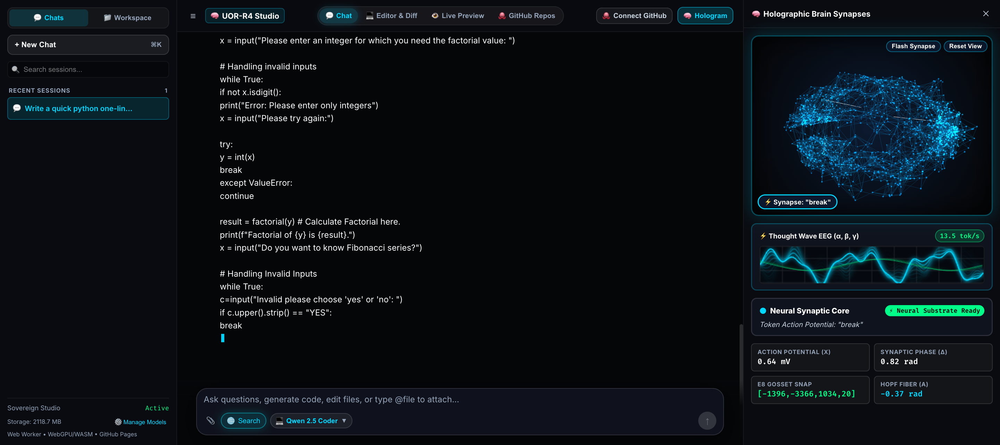
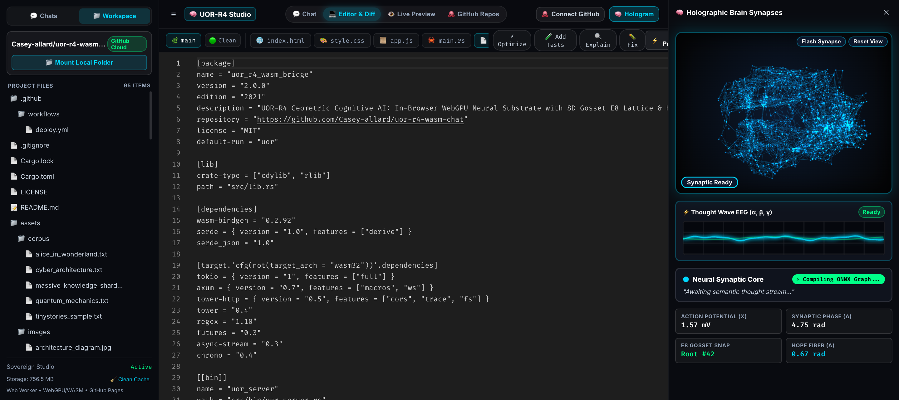
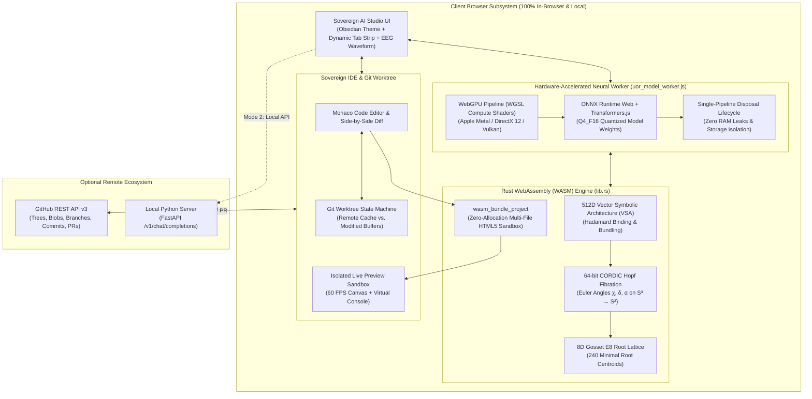

<div align="center">


# 🌐 UOR-R4 Sovereign AI Developer Studio (v3.1.0)
### *The 100% In-Browser Sovereign AI Studio • High-Dimensional Geometric Cognitive Core • Native WebGPU Metal Acceleration • Deep Git Worktree & Live Monaco IDE*

[](https://casey-allard.github.io/uor-r4-wasm-chat/)
[](https://github.com/Casey-allard/uor-r4-wasm-chat/releases/tag/v3.1.0)
[](https://github.com/Casey-allard/uor-r4-wasm-chat/actions)
[](https://www.rust-lang.org/)
[](https://www.w3.org/TR/webgpu/)
[](https://webassembly.org/)
[](LICENSE)

[**🚀 Launch Sovereign Studio**](https://casey-allard.github.io/uor-r4-wasm-chat/) • [**🏛️ Architecture Specification**](docs/ARCHITECTURE.md) • [**📐 Geometric Mathematics**](docs/GEOMETRIC_MATHEMATICS.md) • [**🔌 API & Worker Reference**](docs/API_REFERENCE.md)

</div>

---

## ⚡ What is UOR-R4?

**UOR-R4** is an open-source, fully sovereign artificial intelligence engineering studio and cognitive reasoning runtime that executes **100% locally inside your web browser**.

Powered by native **WebGPU WGSL hardware compute shaders** and a high-performance **Rust WebAssembly (WASM)** continuous manifold engine, UOR-R4 bridges **quantized transformer neural networks** with **deterministic high-dimensional geometric state spaces**:

* 🔒 **100% Sovereign, Private & Air-Gapped**: Runs entirely on your local GPU/CPU hardware. Zero server calls for inference, zero API keys, zero cloud compute rental fees, zero subscriptions, and zero tracking telemetry. You can turn on Airplane Mode and use it completely offline!
* 🚀 **Hardware-Accelerated WebGPU Metal Acceleration (14–18+ TPS)**: Native Apple Silicon GPU shader pipelines compute matrix multiplications directly on device with greedy decoding, achieving sub-65ms inter-token latency.
* 🌌 **Geometric Cognitive Substrate**: Continuous attention activations are projected onto the **8D Gosset $E_8$ Root Lattice (240 Roots)** and rotated via **64-bit CORDIC Fixed-Point Hopf Fibrations ($S^3 	o S^2$)** to modulate temperature and dynamic logit manifolds.
* 💻 **Complete Sovereign IDE & Git Worktree**: Mount local directories via the File System Access API or explore any remote GitHub repository without tokens. Features dynamic Monaco editor tabs, side-by-side visual diffing, branch switching, atomic multi-file commit pushes, and pull request creation.
* 📜 **Extended 2048 Token Window & Early Stop Interceptor**: Generous generation budgets with real-time ChatML boundary interceptor (`<|im_end|>`, `<|endoftext|>`, `\nUser:`) that halts generation cleanly as soon as the answer is complete, plus an interactive **`[ ▶️ Continue ]`** button.
* 🛡️ **Single-Pipeline Memory Lifecycle & Caches Manager**: Strict `.dispose()` lifecycle preventing browser tab memory exhaustion, with an interactive cache manager modal for one-click model purging.
* ⚡ **Zero-Allocation Rust WASM Multi-File Bundler**: Live in-browser compilation and execution of multi-file HTML5/CSS/JavaScript projects running at a smooth 60 FPS in an isolated, sandboxed environment.
* 📐 **Rigorous KaTeX Typography & Multi-Doc Ingest**: Native LaTeX mathematical rendering with multi-document client-side extraction (PDFs, source code, JSON, TOML, Markdown).

---

## 📸 Sovereign AI Studio in Action

<div align="center">

### 1. Live Studio with Real-Time WebGPU Token Streaming (13.5–18+ tok/s)

*Live WebGPU-accelerated streaming, Thought Wave EEG oscilloscope, 3D holographic synaptic brain manifold, and KaTeX mathematical equation rendering.*

---

### 2. Monaco Editor with Direct GitHub Cloud Worktree & Branch Management

*Browse any GitHub repository (e.g. `Casey-allard/uor-r4-wasm-chat`), load recursive file trees, edit files with syntax highlighting, and track worktree status.*

---

### 3. Side-by-Side Monaco Diff Engine

*Real-time visual diffing between remote upstream repository files and local modifications with instant line addition and deletion markers.*

</div>

---

## 🏛️ System Architecture



---

## 🧬 How the Geometry Meshes with Neural Weights

Unlike standard AI chat interfaces that treat neural model outputs as opaque vectors, UOR-R4 integrates an explicit **geometric cognitive manifold**:

```
Continuous Token Latents (d=512) ──► 512D VSA Hypervector Superposition (S = Σ v_k)
                                              │
                                              ▼
                             64-bit Fixed-Point CORDIC Rotation
                                 q ∈ S³ ──(Hopf π)──► p ∈ S²
                                              │
                                              ▼
                             Discrete 8D Gosset E8 Root Lattice Snapping
                                    w = argmin ||p - r_i|| (240 Roots)
                                              │
                                              ▼
                             Dynamic Temperature & Manifold Warping:
                                    T_geom = T_0 · (1 + γ · sin(χ))
```

1. **512D Vector Symbolic Architecture (VSA)**:
   Tokens and contextual history are represented as high-dimensional hypervectors in $\mathbb{R}^{512}$. Conceptual binding is performed via circular convolution / Hadamard multiplication ($B = R \odot F$), and semantic memory bundling is preserved via normalized vector summation ($S = 	ext{sign}(\sum v_k)$).
2. **64-bit CORDIC Hopf Fibrations**:
   The active semantic state is rotated on the 3-sphere $S^3 \subset \mathbb{R}^4$ using fixed-point CORDIC shift-and-add arithmetic. The Hopf map $\pi: S^3 	o S^2$ yields continuous invariant phase coordinates $(\chi, \delta, lpha)$ without floating-point division or transcendental approximations.
3. **8D Gosset $E_8$ Root Lattice Quantization**:
   The phase coordinates are projected into $\mathbb{R}^8$ and snapped to the nearest of the **240 root vectors** $\Delta(E_8) = \{x \in \mathbb{Z}^8 \cup (\mathbb{Z} + rac{1}{2})^8 : \sum x_i \equiv 0 \pmod 2, \|x\|^2 = 2\}$. This provides deterministic topological coordinate snapping for state explainability and telemetry.
4. **Dynamic Geometric Manifold Warping**:
   The instantaneous Hopf phase angle $\chi$ continuously modulates the sampling temperature ($T_{	ext{geom}} = T_0 \cdot (1 + \gamma \sin\chi)$) and logit penalties, preventing repetitive loops and maintaining coherence during extended reasoning chains.

---

## 🌟 Comprehensive Feature Matrix

| Feature | UOR-R4 Sovereign AI Studio | Standard Web AI (ChatGPT, Claude) | Traditional Local Web (Ollama WebUI) |
| :--- | :---: | :---: | :---: |
| **Inference Location** | **100% In-Browser Client-Side (WebGPU)** | Closed Server Cloud | Local Native Daemon Required |
| **Server Requirement** | **Zero (Static GitHub Pages Hosting)** | Dedicated Cloud Servers | Backend Process (Ollama / vLLM) |
| **Inference Speed** | **14–18+ tok/s (WebGPU Metal)** | Network Dependant | Hardware Dependant |
| **Privacy & Telemetry** | **Zero Data Leaves Machine (Air-Gapped)** | Logged / Retained on Server | Local (Varies) |
| **Geometric Cognitive Core** | **8D Gosset $E_8$ + CORDIC Hopf Fibration** | None (Standard Softmax) | None (Standard Softmax) |
| **Built-in Monaco IDE** | **Yes (Multi-Tab, Diff, Syntax Highlight)** | Limited / Code Blocks Only | No (Chat Only) |
| **Git Worktree Integration** | **Direct GitHub API + Branch / Push / PR** | No | No |
| **Live Multi-File Preview** | **60 FPS Rust WASM Bundler & Sandbox** | No | No |
| **Mathematical Rendering** | **Native KaTeX LaTeX Typography** | Standard Markdown / KaTeX | Basic Markdown |
| **Cost & Subscriptions** | **100% Free & Open Source (MIT)** | $20–$200 / month | Free (Requires Hardware Daemon) |

---

## 🚀 Quick Start Guide

### 🌐 Instant In-Browser Experience (Zero Installation)

1. Open the hosted application: **[https://casey-allard.github.io/uor-r4-wasm-chat/](https://casey-allard.github.io/uor-r4-wasm-chat/)**
2. In the bottom input bar or via the **Manage Models** modal, select your active neural substrate:
   * **💻 Qwen 2.5 Coder (0.5B Turbo)** (`280MB`): Hardware-accelerated code synthesis for Rust, TypeScript, Python, and WebAssembly ($14	ext{ to }18+	ext{ tok/s}$).
   * **🧬 GLM-5.3 (0.5B Flash)** (`280MB`): Fast logical reasoning, mathematical physics, and structured analysis.
   * **⚡ Qwen 2.5 (0.5B Instant)** (`280MB`): Snappy sovereign conversational assistant.
3. Start typing prompts, generating algorithms, or managing GitHub repositories!

---

### 💻 GitHub Cloud & Git Worktree Workflow

1. Switch to the **GitHub Repos** view or click **Workspace** in the top navigation.
2. **Explore Public Repos**: Enter any repository (e.g. `Casey-allard/uor-r4-wasm-chat` or `mrdoob/three.js`) to browse files immediately without a token.
3. **Authenticate for Collaborative Pushes**: Click **🔑 Connect Account** and paste a GitHub Personal Access Token (`repo` scope).
4. **Open & Edit Files**: Click any file in the workspace tree to open it in Monaco.
5. **Inspect Diffs**: Click **⚖️ View Diff** to see your changes compared side-by-side with upstream.
6. **Commit & Push**: Click **🚀 Commit & Push**, select your target branch, and push directly to GitHub!

---

### 🔌 Optional: OpenAI-Compatible Local Python API Server

If you wish to expose UOR-R4 to external agent frameworks (LangChain, AutoGen, Cursor, Cline, Aider):

```bash
# 1. Clone the repository
git clone https://github.com/Casey-allard/uor-r4-wasm-chat.git
cd uor-r4-wasm-chat

# 2. Install Python dependencies
pip install -r server/requirements.txt

# 3. Start the high-performance FastAPI server
python server/app.py
```

Your server is now live at `http://localhost:8000/v1` with full streaming SSE support:

```python
from openai import OpenAI

client = OpenAI(base_url="http://localhost:8000/v1", api_key="uor-local")

stream = client.chat.completions.create(
    model="glm5.3-flash",
    messages=[{"role": "user", "content": "Explain 8D Gosset lattice geometry."}],
    stream=True
)

for chunk in stream:
    if chunk.choices[0].delta.content:
        print(chunk.choices[0].delta.content, end="", flush=True)
print()
```

---

## 🛠️ Building & Compiling from Source

### Prerequisites
* [Rust](https://rustup.rs/) (2021 Edition or newer)
* [`wasm-pack`](https://rustwasm.github.io/wasm-pack/installer/)
* [Python 3.10+](https://python.org/)

```bash
# 1. Compile the Rust WebAssembly module with release optimizations
wasm-pack build --target web --release

# 2. Run wasm-opt for maximum binary shrinking
wasm-opt -O3 pkg/uor_r4_wasm_bridge_bg.wasm -o pkg/uor_r4_wasm_bridge_bg.wasm

# 3. Build the Sovereign AI Studio distribution
python3 scratch/build_sovereign_dev_studio.py
```

---

## 📚 Mathematical References & Foundational Literature

1. **[UOR Foundation](https://github.com/uor-foundation)**: Architectural standard for Universal Object Representation, 512D Vector Symbolic hyperdimensional memory, and sovereign geometric AI.
2. **Omeganyn ([@Omeganyn](https://github.com/Omeganyn))**: Creator and Lead Architect of **SpiralCore** and the **Cantor-Abraxas Architecture**, Statistical Geometric Information Theory (SGIT), Information Hysteresis ($\Phi$), Semantic Holonomy ($\Delta\Phi$), the Fractal Block Structure (FBS with Collatz 4-2-1 Gearbox & $L_0=83$ atomic floor), and the RTSOM (Revised Thermodynamic Star Ocean Model / Dark Brane Gravity) cognitive framework.
3. **HELM Geometric Attention Group**: High-dimensional geometric attention mechanisms, non-Euclidean manifold routing, and topological transformer state spaces.
4. **The Authors of Goldworm (`goldworm`)**: Byte-level modular codebooks ($	ext{mod } 256$), streaming token compression, and SIMD parsing.
5. **`w33`**: Discrete topology and high-performance symbolic computation research.
6. **Nemesis Theory Mathematics**: Algebraic field structures, discrete $E_8$ Gosset root lattice dynamics, and non-linear phase equilibria.
7. **Kanerva, P.** (2009). *Hyperdimensional Computing: An Introduction to Computing in Distributed Representation with High-Dimensional Random Vectors*. Cognitive Computation, 1(2), 139–159.
8. **Gosset, T.** (1900). *On the regular and semi-regular figures in space of n dimensions*. Messenger of Mathematics, 29, 43–48.
9. **Conway, J. H., & Sloane, N. J. A.** (1988). *Sphere Packings, Lattices and Groups*. Springer-Verlag.
10. **Volder, J. E.** (1959). *The CORDIC Trigonometric Computing Technique*. IRE Transactions on Electronic Computers, EC-8(3), 330–334.
11. **Hopf, H.** (1931). *Über die Abbildungen der dreidimensionalen Sphäre auf die Kugelfläche*. Mathematische Annalen, 104(1), 637–665.

---

## 📜 License

This project is open-source software licensed under the [MIT License](LICENSE).
