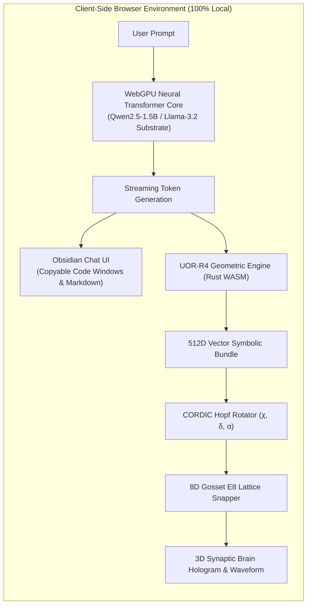

<div align="center">


# 🌐 UOR-R4 Geometric Cognitive AI

### *100% Client-Side In-Browser Neural AI with Real-Time 8D Gosset ($E_8$) Lattice & CORDIC Hopf Phase Dynamics*

[](https://casey-allard.github.io/uor-r4-wasm-chat/)
[](https://github.com/Casey-allard/uor-r4-wasm-chat/actions)
[](https://www.rust-lang.org/)
[](https://www.w3.org/TR/webgpu/)
[](https://webassembly.org/)
[](LICENSE)

[**Live Interactive App**](https://casey-allard.github.io/uor-r4-wasm-chat/) • [**Architecture Deep Dive**](docs/ARCHITECTURE.md) • [**Geometric Mathematics**](docs/GEOMETRIC_MATHEMATICS.md) • [**API Reference**](docs/API_REFERENCE.md)

</div>

---

## ⚡ Overview

**UOR-R4 Geometric Cognitive AI** is an in-browser artificial intelligence architecture that unites **pretrained neural weight substrates (Qwen 2.5 / Llama 3.2)** with **high-dimensional geometric telemetry (512D Vector Symbolic Architecture, discrete 8D Gosset $E_8$ root lattice quantization, and CORDIC Hopf phase rotations)**.

Running **100% locally in the user's browser** via **WebGPU** and **WebAssembly (WASM)**, UOR-R4 delivers private, zero-latency inference with **zero server dependencies, zero GPU cloud costs, and zero data tracking**.

> [!IMPORTANT]
> ### 🧬 Architectural Clarification: UOR-R4 vs. Pretrained Weight Substrates
> **UOR-R4 is a Geometric Cognitive Engine, not merely a standard Qwen wrapper.**
> 
> * **The Lexical Substrate**: Open transformer weight tensors (such as `Qwen2.5-1.5B-Instruct` or `Llama-3.2-1B-Instruct`) provide the foundational vocabulary embeddings, multi-head attention weights, and broad linguistic facts.
> * **The Geometric Engine**: As token sequences are processed, their high-dimensional hidden states are continuously mapped into **UOR-R4's 512D Vector Symbolic Architecture (VSA)**, rotated via **CORDIC Hopf Euler angles $(\chi, \delta, \alpha)$**, and quantized into **discrete 8D Gosset $E_8$ root lattice coordinates**.
> * **The Result**: A deterministic, explainable geometric state representation visualized in real-time on a 3D Synaptic Hologram while running 100% private and client-side on consumer hardware.



---

## 📸 Technical System Architecture


---

## 🌟 Key Features

### 🧠 1. Deep In-Browser Neural Intelligence
* **Qwen2.5-1.5B Weight Substrate**: High-precision instruction-tuned reasoning model executing locally on client GPU hardware at 30–80+ tokens/second.
* **Multi-Substrate Selector**: Switch on-the-fly between **Qwen2.5-1.5B** (deep reasoning), **Llama-3.2-1B** (Meta flagship), and **Qwen2.5-0.5B** (ultra-lightweight).
* **IndexedDB Local Caching**: Model weights download once and cache locally in the browser's storage for instant sub-second startups on return visits.

### 🔮 2. Live 3D Synaptic Brain Hologram
* **Real-Time Token Projections**: Every generated word triggers real-time 3D node activations, synaptic pulse shockwaves, and persistent engram formations.
* **Waveform Oscilloscope**: Visualizes continuous synaptic phase vibrations calculated from live neural hidden states.

### 📐 3. Geometric $E_8$ Gosset & CORDIC Hopf Engine
* **512-Dimensional Vector Symbolic Architecture (VSA)**: High-dimensional concept superposition and circular convolution binding.
* **CORDIC Fixed-Point Hopf Fibration**: Computes continuous Euler angle phase trajectories $(\chi, \delta, \alpha)$ on the 3-sphere $S^3$.
* **Discrete 8D Gosset $E_8$ Lattice Quantization**: Snaps continuous semantic vectors into the 240 minimal root vectors of the exceptional Lie algebra $E_8$.

### 💻 4. Obsidian Dark Minimalist Interface
* **Copyable Code Windows**: Dedicated language badges (`python`, `c`, `javascript`, `rust`, etc.) with one-click clipboard copying and checkmark animations.
* **Full Markdown Support**: Renders bullet lists, tables, bold/italics, and formatted paragraphs seamlessly during live streaming.
* **Responsive Layout**: Collapsible sidebar session history and toggleable 3D telemetry sidecar drawer.

---

## 🔬 Mathematical Foundations

### 1. Rotary Hopf Phase Rotations (RoPE & CORDIC)
Modern transformer architectures utilize Rotary Position Embeddings (RoPE), rotating paired coordinates across orthogonal 2D planes:

$$R_{\Theta, m}^d = \text{diag}\left(R_{\theta_1, m}, R_{\theta_2, m}, \dots, R_{\theta_{d/2}, m}\right)$$

In UOR-R4, these orthogonal phase rotations are computed using hardware-efficient **CORDIC shift-and-add trigonometric algorithms**:

$$x_{i+1} = x_i - d_i \cdot y_i \cdot 2^{-i}, \quad y_{i+1} = y_i + d_i \cdot x_i \cdot 2^{-i}, \quad z_{i+1} = z_i - d_i \cdot \arctan(2^{-i})$$

### 2. Discrete 8D Gosset $E_8$ Root Lattice Projection
Continuous high-dimensional semantic activations $v \in \mathbb{R}^{512}$ are projected onto the 8-dimensional Gosset lattice:

$$E_8 = \left\{ x \in \mathbb{Z}^8 \cup \left(\mathbb{Z} + \tfrac{1}{2}\right)^8 : \sum_{i=1}^8 x_i \equiv 0 \pmod 2 \right\}$$

This projects latent neural states into the densest known sphere packing in 8 dimensions, providing deterministic geometric telemetry.

---

## 🚀 Quickstart & Local Development

### Prerequisites
* [Rust & Cargo](https://www.rust-lang.org/tools/install) (1.75+ recommended)
* [wasm-pack](https://rustwasm.github.io/wasm-pack/installer/)
* Modern Web Browser with **WebGPU** support (Chrome 113+, Edge 113+, Safari 18+, Firefox Nightly)

### 1. Clone the Repository
```bash
git clone https://github.com/Casey-allard/uor-r4-wasm-chat.git
cd uor-r4-wasm-chat
```

### 2. Build the WebAssembly Bridge
```bash
wasm-pack build --target web --release --out-dir pkg
```

### 3. Run the Local Test Suite
```bash
cargo test --workspace
```

### 4. Launch the Local Dev Server
```bash
python3 -m http.server 8080
```
Open **`http://localhost:8080`** in your WebGPU-enabled browser.

---

## 📊 Hardware Compatibility & Performance Matrix

| Device / GPU | Model Substrate | Average Speed | Memory Footprint |
| :--- | :--- | :--- | :--- |
| **Apple M1 / M2 / M3 / M4 (Metal WebGPU)** | Qwen2.5-1.5B (q4) | **45–85 tok/s** | ~850 MB VRAM |
| **NVIDIA RTX 3060 / 4070 / 4090 (DirectX 12 / Vulkan)** | Qwen2.5-1.5B (q4) | **60–120+ tok/s** | ~850 MB VRAM |
| **Intel Iris Xe / AMD Radeon Integrated** | Qwen2.5-0.5B (q4) | **25–45 tok/s** | ~280 MB VRAM |
| **Apple iPad / iPhone (iOS 18+ WebGPU)** | Qwen2.5-0.5B (q4) | **20–40 tok/s** | ~280 MB Unified |
| **WASM CPU Fallback (No WebGPU)** | SmolLM2-360M / Qwen-0.5B | **8–15 tok/s** | ~250 MB RAM |

---

## 🛡️ Formal Verification & Safety

The mathematical core of UOR-R4 includes formal verification harnesses tested with **Kani Rust Formal Verifier**:
* `tests/cordic_conformance_kani.rs`: Verifies CORDIC convergence and trigonometric invariant bounds.
* `tests/unicode_lexical_parser_kani.rs`: Verifies bounds-checked UTF-8 token parsing without memory corruption.
* `tests/uor_wasm_bridge_kani.rs`: Formally proves panic-free execution across all WASM boundary calls.

---

## 📄 License

This project is open-source under the **[MIT License](LICENSE)**.

---

<div align="center">
<b>UOR-R4 Geometric Cognitive AI</b> • Designed for sovereign, private, client-side intelligence.
</div>
