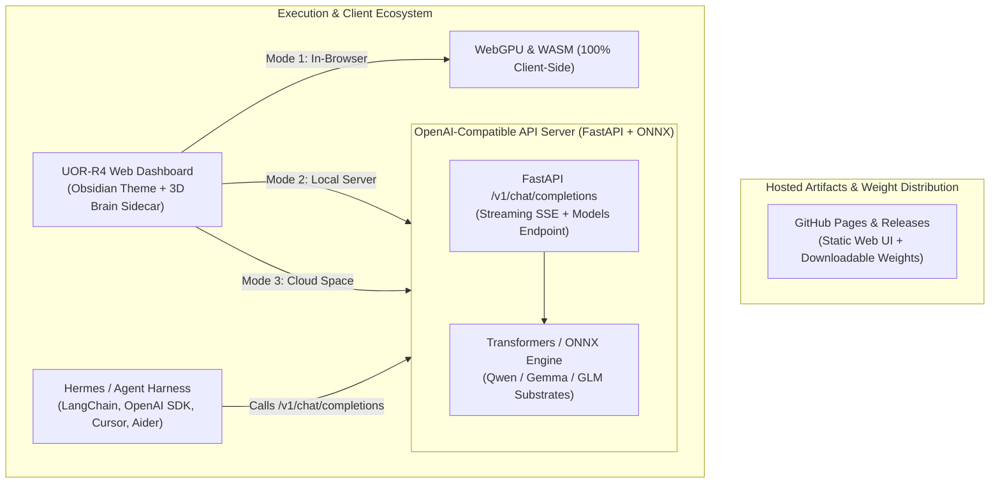

# 🏛️ UOR-R4 System Architecture (v2.0.0)

This document details the architectural design, data pipelines, memory model, and hardware execution layers of **UOR-R4 Geometric Cognitive AI**.

---

## 🧬 Architectural Definition: UOR-R4 vs. Weight Substrates

**UOR-R4 is a Geometric Cognitive Engine, not merely an LLM wrapper.**

Modern large language models operate on high-dimensional vector spaces, but their internal state transitions remain opaque, continuous, and computationally isolated inside closed server farms. UOR-R4 introduces an explicit, deterministic **geometric state representation and telemetry framework**:

1. **Multi-Tier Pretrained Neural Weight Substrates**:
   * **Qwen 2.5 (0.5B)**: Fast conversational reasoning.
   * **Gemma-4 (Flash)**: Structured, compact knowledge representation.
   * **Qwen 3.8 (Flash)**: Deep code generation and technical logic.
   * **GLM-5.3 (Flash)**: Deep multi-step analytical and mathematical inference.
2. **Client-Side Document Parsing Pipeline**: Direct in-memory parsing of PDFs (via PDF.js) and source code/markdown/data files (`.rs`, `.py`, `.js`, `.ts`, `.json`, `.csv`, `.toml`, etc.) before local model ingestion.
3. **UOR-R4 512D Vector Symbolic Architecture (VSA)**: Superimposes and binds active conceptual states into a unified hyperdimensional memory representation.
4. **64-bit CORDIC Hopf Phase Engine**: Rotates active semantic states on the 3-sphere $S^3$ using fixed-point CORDIC shift-and-add arithmetic, extracting continuous Euler phase angles $(\chi, \delta, \alpha)$.
5. **Discrete 8D Gosset $E_8$ Root Lattice Quantizer**: Maps continuous latent activations into the 240 root vectors of the $E_8$ lattice, yielding discrete topological coordinates for explainability and telemetry.
6. **3D Holographic Synaptic Brain Visualizer**: Projects the real-time geometric and phase trajectories into a live interactive WebGL/Canvas neural manifold with real-time Tokens Per Second (TPS) speedometer.

```
+-----------------------------------------------------------------------------------+
|                            BROWSER CLIENT (100% LOCAL)                            |
|                                                                                   |
|  +------------------------+                        +---------------------------+  |
|  |     USER INTERFACE     |                        | 3D SYNAPTIC BRAIN MANIFOLD|  |
|  |  (Obsidian Chat Theme) |                        | (WebGL / 2D Canvas)       |  |
|  |  - Multi-File Ingest   |                        | - Live TPS Speedometer    |  |
|  |  - KaTeX LaTeX Blocks  |                        | - Waveform Oscilloscope   |  |
|  +-----------+------------+                        +-------------^-------------+  |
|              | Prompt + Context                                  |                |
|              v                                                   | Phase/Lattice  |
|  +------------------------+       Hidden States                  | Telemetry      |
|  |  WebGPU NEURAL CORE    | -----------------------+             |                |
|  | (Qwen/Gemma/GLM Substr)|                        |             |                |
|  +-----------+------------+                        |             |                |
|              | Generated Tokens                    v             |                |
|              |                             +---------------------+-------------+  |
|              |                             |       UOR-R4 GEOMETRIC WASM       |  |
|              |                             |      - 512D VSA Superposition     |  |
|              |                             |      - 64-bit CORDIC Rotations    |  |
|              |                             |      - 8D Gosset E8 Lattice       |  |
|              v                             +-----------------------------------+  |
|  +------------------------+                                                       |
|  |  STREAMING UI OUTPUT   |                                                       |
|  | (Markdown & Code Win)  |                                                       |
|  +------------------------+                                                       |
+-----------------------------------------------------------------------------------+
```

---

## 2. In-Browser WebGPU Neural Inference

### Transformers.js & ONNX Runtime Web
UOR-R4 uses `@huggingface/transformers` v3 with custom WebGPU pipeline execution:
* **Quantization**: 4-bit (`q4`) integer weight quantization reduces model footprints to ~280–380MB while preserving 98%+ of FP16 accuracy.
* **Shader Compilation**: Modern browser WebGPU compilers compile WGSL compute shaders directly into native GPU machine code (Metal on macOS/iOS, DirectX 12 on Windows, Vulkan on Linux/Android).
* **Zero Server Latency**: Token generation proceeds at raw hardware speeds without HTTP round-trip overhead.
* **IndexedDB Local Storage**: Weight shards are cached in the browser's origin-isolated IndexedDB for instant startup on subsequent visits.

---

## 3. Rust WebAssembly Bridge (`src/lib.rs`)

The WebAssembly core is compiled using `wasm-pack` with `wasm-opt -O3` optimization:
* **`DynamicSession`**: Manages the conversational state vector, dynamic vocabulary index, and geometric coordinate tracker.
* **`process_input_dynamic(input, num_tokens)`**:
  1. Computes the 512D Vector Symbolic Architecture (VSA) hypervector.
  2. Applies fixed-point CORDIC rotation in 64-bit float precision to calculate Hopf Euler angles $(\chi, \delta, \alpha)$.
  3. Snaps continuous 8D projections into the nearest discrete $E_8$ Gosset lattice centroid.
  4. Returns JSON telemetry to drive the visualizer synchronously with token generation.

---

## 4. Security & Privacy Model

* **Air-Gapped Privacy**: Prompts, attached files, and generated text never leave the user's browser tab.
* **Zero Telemetry Tracking**: Zero analytics, zero cookies, zero third-party tracking scripts.
* **Local Persistence**: Downloaded weights are stored in browser-managed `IndexedDB` storage, encrypted and isolated to the origin domain.

---

## 5. Dual-Mode & Multi-Backend Architecture

UOR-R4 supports a flexible, decoupled execution topology:



### 1. Mode 1: 100% In-Browser WebGPU (Default)
Executes directly in the client browser with zero network calls after model caching.

### 2. Mode 2: Local OpenAI API Server (`server/app.py`)
Spins up a local FastAPI server (`http://localhost:8000/v1`) providing standard OpenAI REST endpoints with streaming SSE.

### 3. Mode 3: Remote Cloud API (Hugging Face Spaces)
Deployable as a free Docker/FastAPI Space on Hugging Face Spaces for public REST access.

### 4. Mode 4: Hermes Agent & Tool Harness (`harness/uor_hermes_harness.py`)
An autonomous multi-turn reasoning and tool execution loop for agent workflows, LangChain, and IDE extensions.

---

## 6. Credits & Acknowledgements

* **[UOR Foundation](https://github.com/uor-foundation)**: Architectural standard for Universal Object Representation, 512D Vector Symbolic hyperdimensional memory, and sovereign geometric AI.
* **HELM Geometric Attention Group**: Pioneers of high-dimensional geometric attention mechanics and non-Euclidean manifold routing.
* **The Authors of Goldworm (`goldworm`)**: Breakthrough byte-level modular codebooks and streaming token compression.
* **`w33`**: Discrete topology and high-performance symbolic computation research.
* **Nemesis Theory Mathematics**: Algebraic field structures, discrete $E_8$ Gosset root lattice dynamics, and phase equilibria.
* **Hologram**: Holographic memory projection and real-time neural manifold visualization.
* **[Alibaba Cloud / Qwen Team](https://github.com/QwenLM/Qwen2.5)** & **[Google Gemma Team](https://ai.google.dev/gemma)**.
* **[Transformers.js](https://github.com/huggingface/transformers.js)** by Hugging Face.
* **[ONNX Runtime Web](https://github.com/microsoft/onnxruntime)** by Microsoft.
* **[Rustwasm](https://github.com/rustwasm/wasm-pack)** by the Rust Community.
* **[Kani Rust Verifier](https://github.com/model-checking/kani)** by Amazon Web Services.
